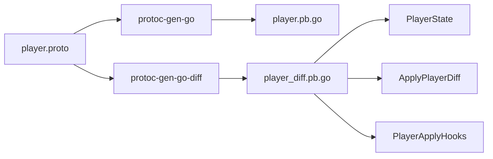
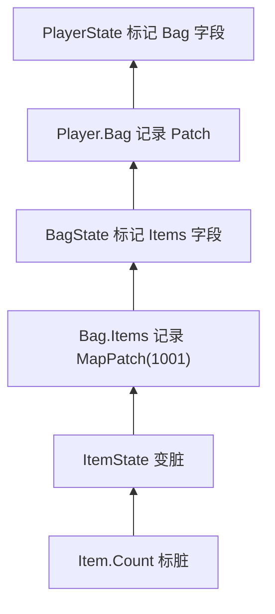
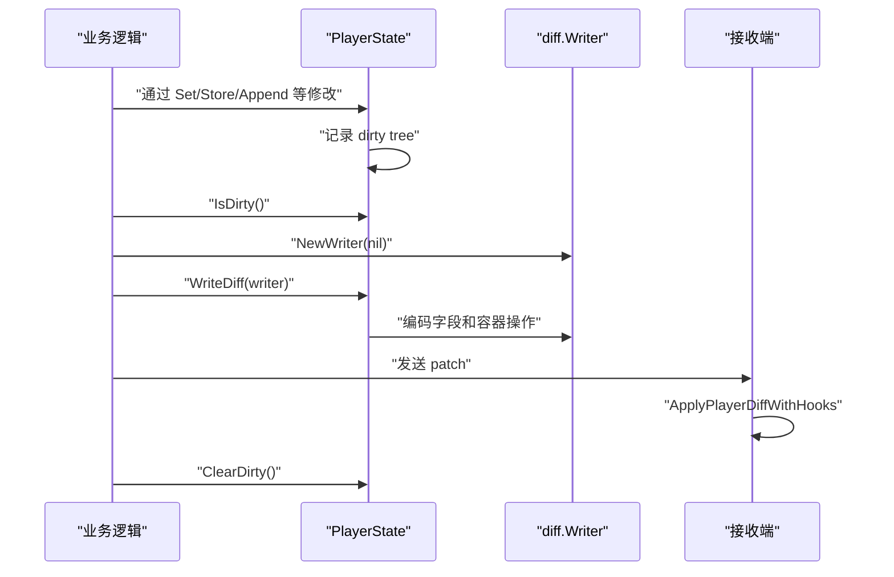

# 从全量 Proto 到字段级 Patch：设计一个适合游戏服务器的增量系统

项目地址：[github.com/2comjie/nova](https://github.com/2comjie/nova)

增量系统实现：[nova/diff](https://github.com/2comjie/nova/tree/main/diff)

在游戏服务器中，玩家数据通常会被组织成一棵很大的 Proto 数据树：角色基础信息、背包、任务、邮件、好友、活动状态都挂在 Player 下面。

一次业务操作可能只改变一个很小的值：

```text
Player.Bag.Items[1001].Count: 10 -> 9
```

如果每次修改都重新序列化整个 Player，再把完整数据保存到数据库或推送给客户端，功能当然可以实现，但代价也很明显：

- Player 越大，序列化和网络开销越高。
- 修改频率高时，大量没有变化的数据被反复复制。
- 客户端只能看到新的完整状态，不知道这次具体发生了什么。
- “物品减少后弹出消耗提示”这类逻辑，只能在新旧快照之间再次计算差异。

本文介绍一种基于 Proto 和代码生成的增量方案。业务仍然只定义正常的 Proto，生成器额外产生类型安全的状态操作代码；业务通过生成的 API 修改数据，框架自动记录脏字段，最后编码成紧凑的二进制 Patch。

完整实现位于 Nova 的 `diff` 包。

## 一、先确定增量系统要解决什么

这个增量系统只负责两件事：

1. 记录一个 Proto 状态树发生了哪些变化。
2. 把这些变化编码出来，并合并到另一份 Proto 状态。

版本号、Ack、重发、断线重连和全量快照属于状态同步层。它们会建立在增量数据之上，但不应该混入字段级增量的核心逻辑。

最终希望业务代码写成这样：

```go
state := pb.NewPlayerState(player)

item, ok := state.GetBag().Items().GetValue(1001)
if ok {
	item.SetCount(item.GetCount() - 1)
}

writer := diff.NewWriter(nil)
state.WriteDiff(writer)
patch := writer.Data()
state.ClearDirty()
```

接收端只需要：

```go
if err := pb.ApplyPlayerDiff(player, patch); err != nil {
	return err
}
```

这里有几个关键要求：

- API 必须是具体类型，不能让业务到处传 `any`。
- 嵌套对象修改后，脏标记必须自动向上冒泡。
- Map 和 List 必须记录操作，不能每次替换整个容器。
- 接收端需要可选的业务 Hook。
- 业务不能再手工维护一份“增量 Proto”。

## 二、为什么选择代码生成

实现增量通常有三种思路。

### 1. 保存前后快照，再计算 Diff

这种方式接入简单，但每次都需要遍历两棵完整数据树。玩家数据越大，比较成本越高；为了保留旧快照，还会产生额外的内存和复制开销。

### 2. 使用反射代理所有字段

反射可以减少生成代码，但业务最终会失去清晰的类型 API。复杂的 Map、List 和嵌套 Message 仍然需要额外包装，而且运行时错误更难提前发现。

### 3. 根据 Proto 生成 State

Proto 本身已经包含完整的字段类型、field number 和嵌套关系。生成器可以为每个 Message 产生对应的 State：

```text
Player       -> PlayerState
Bag          -> BagState
Item         -> ItemState
map items    -> BagItems
repeated ids -> BagOrder
```

这样既保留了类型安全，也不需要运行时遍历完整对象。一次修改只触碰当前字段以及它到根节点的父链。

因此 Nova 选择第三种方案：



业务仍然只维护一份 Proto Schema，增量代码全部由生成器产生。

## 三、数据必须是一棵树，而不是指针图

在讨论脏标记之前，必须先确定数据模型。

假设同一个 `*Item` 同时被 Bag 的 Map 和另一个 List 引用：

```go
item := &pb.Item{Id: 1001, Count: 10}
player.Bag.Items[1001] = item
player.Favorites = append(player.Favorites, item)
```

修改这个 Go 指针时，两个位置都会看到新值。但 Proto 序列化并不保存 Go 指针身份，接收端反序列化后会得到两个独立对象。增量系统也无法判断本次修改应该沿哪条父链传播。

所以增量状态必须遵守一个约束：

> Message 是树形所有权对象；跨模块引用通过 Id 表达，不共享 Message 指针。

背包可以这样定义：

```proto
message Bag {
  map<uint64, Item> items = 1;
  repeated uint64 order = 2;
}

message Item {
  uint64 id = 1;
  int32 count = 2;
  int32 level = 3;
}
```

`items` 持有 Item，`order` 只保存 Item Id。其他系统需要引用物品时同样只保存 Id。

这个约束不仅让增量系统更简单，也让数据持久化、跨节点传输和状态恢复的语义保持一致。

## 四、每个 Message 都有一个 State

对于：

```proto
message Item {
  uint64 id = 1;
  int32 count = 2;
  int32 level = 3;
}
```

生成器会产生类似下面的结构：

```go
type ItemState struct {
	value      *Item
	dirty      [1]uint64
	markParent func()
}
```

对外方法为：

```go
func NewItemState(value *Item) *ItemState
func (s *ItemState) GetRawValue() *Item
func (s *ItemState) IsDirty() bool
func (s *ItemState) WriteDiff(writer *diff.Writer)
func (s *ItemState) ClearDirty()

func (s *ItemState) GetCount() int32
func (s *ItemState) SetCount(value int32)
```

`SetCount` 的核心逻辑很简单：

```go
func (s *ItemState) SetCount(value int32) {
	if s.value.Count == value {
		return
	}
	s.value.Count = value
	if diff.MarkDirty(&s.dirty[itemStateDirtyCountWord], itemStateDirtyCountMask) && s.markParent != nil {
		s.markParent()
	}
}
```

相同值不会重复标脏。字段第一次变脏时，State 才通知父节点。

### Dirty bitmap 如何处理大量字段

每个字段的 word 和 mask 都由生成器写死：

```go
const itemStateDirtyIdWord uint32 = 0
const itemStateDirtyIdMask uint64 = 1
const itemStateDirtyCountWord uint32 = 0
const itemStateDirtyCountMask uint64 = 2
const itemStateDirtyLevelWord uint32 = 0
const itemStateDirtyLevelMask uint64 = 4
```

字段超过 64 个时，不需要换成 Map，也不需要限制 Message 大小。State 使用多个 `uint64`：

```text
wordCount = ceil(fieldCount / 64)
word       = fieldIndex / 64
mask       = 1 << (fieldIndex % 64)
```

例如 600 个字段会使用 10 个 word。

这里的 fieldIndex 只用于进程内的脏标记，不进入网络协议。真正编码时使用的是 Proto field number，因此 bitmap 的内部布局不会影响协议兼容性。

## 五、脏标记如何从 Item 冒泡到 Player

假设业务执行：

```go
item, _ := playerState.GetBag().Items().GetValue(1001)
item.SetCount(9)
```

实际传播路径为：



每个子 State 创建时都会拿到父节点提供的 `markParent`：

```go
state.item = newItemState(value, state.markItemDirty)
```

叶子字段负责记录具体变化，父节点只需要知道“这个子节点里有增量”。最终写出的结构为：

```text
Player.Bag Patch {
    Bag.Items MapPatch key=1001 {
        Item.Count SetVarint value=9
    }
}
```

这就是一棵 dirty tree。修改成本与数据树深度相关，而不是与整个 Player 的字段数量相关。

## 六、不同 Proto 类型如何产生增量

### 1. 基础类型

基础类型生成 `GetX/SetX`：

| Proto 类型 | 编码方式 |
| --- | --- |
| `bool`、`enum`、`int32/int64`、`uint32/uint64` | Varint |
| `sint32/sint64` | ZigZag Varint |
| `fixed32/sfixed32/float` | Little-endian Fixed32 |
| `fixed64/sfixed64/double` | Little-endian Fixed64 |
| `string`、`bytes` | Length-delimited bytes |

`bytes` 比其他基础类型更特殊。slice 是引用类型，如果直接保存调用方传入的 slice，调用方可以绕过 Setter 修改内部数据。因此 Getter 和 Setter 都需要复制：

```go
payload := []byte{1, 2, 3}
state.SetPayload(payload)
payload[0] = 9 // 不影响 State。

copyValue := state.GetPayload()
copyValue[0] = 8 // 同样不影响 State。
```

### 2. 普通 Message

对于：

```proto
Bag bag = 2;
```

生成三类方法：

```go
GetBag() *BagState
SetBag(value *Bag)
ClearBag()
```

它们对应三种操作：

- `GetBag().SetX(...)`：`Patch`，只写 Bag 内部变化。
- `SetBag(...)`：`Replace`，整体替换 Bag。
- `ClearBag()`：`Clear`，把 Bag 设置为 nil。

`SetBag` 会克隆输入的 Message，避免调用方继续持有原指针并绕过 State 修改。

### 3. Map

Map 不能只有一个“字段脏了”的标记，因为接收端还需要知道哪个 key 发生了什么变化。

生成的容器提供：

```go
GetValue(key) (value, bool)
Store(key, value)
Delete(key)
Clear()
Len() int
Range(func(key, value) bool)
```

对应的增量操作为：

| API | Operation |
| --- | --- |
| `Store` | `MapPut` |
| `Delete` | `MapDelete` |
| `Clear` | `Clear` |
| 修改 Message value | `MapPatch` |

当 Map value 是 Message 时，`GetValue` 返回子 State：

```go
item, ok := bagState.Items().GetValue(1001)
if ok {
	item.SetCount(9)
}
```

同一个 key 会缓存同一个 ItemState。`Store`、`Delete` 和 `Clear` 会让旧 State 与父容器断开，防止业务还持有旧引用时继续把 Bag 标脏。

同一个 dirty 周期内，同一个 key 只保留一个变更槽位：

- Put 后继续修改新对象，仍然只编码 Put，写出时序列化最终对象。
- Patch 后又 Put，最终编码 Put。
- Put 或 Patch 后 Delete，最终编码 Delete。
- Clear 会丢弃它之前尚未写出的 Map 操作；Clear 后仍可继续追加新的 Put。

这种合并避免了同一个 key 产生一串没有意义的中间操作。

### 4. Repeated

List 生成：

```go
GetValue(index int) (value, bool)
Store(index, value)
Append(value)
Insert(index, value)
Delete(index)
Move(from, to)
Clear()
Len() int
Range(func(index, value) bool)
```

对应：

| API | Operation |
| --- | --- |
| `Append` | `ListAppend` |
| `Insert` | `ListInsert` |
| `Store` | `ListSet` |
| `Delete` | `ListDelete` |
| `Move` | `ListMove` |
| `Clear` | `Clear` |
| 修改 Message element | `ListPatch` |

与 Map 不同，List 的结构变化会影响后续 index，因此操作必须按发生顺序保存和执行。

例如：

```go
list.Insert(0, itemA)
list.Move(2, 1)
list.Delete(3)
```

接收端也按照 Insert、Move、Delete 的顺序执行，才能得到相同结果。

Message List 的 State 按底层 Message 指针缓存。元素 Move 后，State 仍然表示同一个对象；当它再次发生修改时，生成代码会在当前 List 中重新定位该对象的 index。

通过 Append、Insert、Store 放入的新 Message 会被克隆。如果新对象在同一个 dirty 周期内继续修改，不再额外生成 ListPatch，因为完整的 List 操作会在 WriteDiff 时序列化它的最终值。

## 七、增量二进制如何编码

如果再定义一套 Patch Proto，例如为每个业务字段手工编写 `updated/value`，维护成本会非常高：业务 Proto 每增加一个字段，增量 Proto 也要同步增加字段。

Nova 使用一套通用操作流，不为每个业务 Message 定义额外的增量结构：

```text
[Tag] [Payload] [Tag] [Payload] ...
```

### Tag

Tag 是一个 unsigned varint：

```text
tag = (fieldNumber << 5) | operation
```

低 5 位保存操作码，高位保存 Proto field number。当前最大操作码是 16，5 位足够表示。

例如 field number 为 2，操作为 Patch（6）：

```text
(2 << 5) | 6 = 70
```

70 再使用 UVarint 写入。

### Operation

当前操作分为四组：

```text
基础字段：SetVarint / SetFixed32 / SetFixed64 / SetBytes
Message： Clear / Patch / Replace
List：    ListAppend / ListInsert / ListSet / ListDelete / ListMove / ListPatch
Map：     MapPut / MapDelete / MapPatch
```

Operation 不只是描述“发生了什么”，也直接告诉接收端“应该如何合并”，因此不需要额外的 ApplyCode。

### 基础字段 Payload

```text
SetVarint: [Tag] [UVarint]
SetFixed32: [Tag] [4 bytes little-endian]
SetFixed64: [Tag] [8 bytes little-endian]
SetBytes: [Tag] [Length UVarint] [Bytes]
Clear: [Tag]
```

### 复杂操作 Payload

复杂操作使用统一的长度块：

```text
[Tag] [BlockLength UVarint] [Block]
```

Block 的内容由操作决定：

```text
Patch:       [Child Diff]
Replace:     [Proto Marshal Result]

ListAppend:  [Value]
ListInsert:  [Index] [Value]
ListSet:     [Index] [Value]
ListDelete:  [Index]
ListMove:    [From] [To]
ListPatch:   [Index] [Child Diff]

MapPut:      [Key] [Value]
MapDelete:   [Key]
MapPatch:    [Key] [Child Diff]
```

完整 Message value 使用标准 `proto.Marshal`；嵌套 Patch 则递归使用同一套增量格式。

Writer 写 Block 时先预留一个字节：

```go
func (w *Writer) writeBlock(fieldNumber uint32, operation Operation, write func(*Writer)) {
	w.writeTag(fieldNumber, operation)
	lengthIndex := len(w.data)
	w.data = append(w.data, 0)
	write(w)

	size := len(w.data) - lengthIndex - 1
	// 小于 128 时直接回填一个字节；否则扩展为 UVarint。
}
```

绝大多数小 Patch 只需要一个长度字节；大 Block 再扩展成完整 UVarint。

## 八、接收端如何合并

每个 Message 会生成两个入口：

```go
func ApplyPlayerDiff(value *Player, data []byte) error
func ApplyPlayerDiffWithHooks(value *Player, data []byte, hooks *PlayerApplyHooks) error
```

Apply 的流程是：


Reader 只负责切分操作，生成代码负责校验“当前字段是否允许当前 Operation”。例如基础 int32 字段收到 MapPut，就会返回 `diff.ErrInvalidData`。

接收端不认识的 field number 会跳过，因此发送端新增普通字段时，旧版本接收端可以忽略它。已经使用的 field number 不能复用，也不能随意改变字段类型。

## 九、为什么 Apply 还需要 Hook

只把数据合并正确还不够。客户端经常需要知道变化本身：

- 物品数量减少，弹出消耗提示。
- 新增物品，播放获得动画。
- 阵容位置移动，刷新对应 UI。
- 整个 Bag 被替换，重新构建背包界面。

如果客户端在 Apply 前后复制完整 Player 再比较，等于重新引入一次全量 Diff。

生成器会为基础字段生成：

```go
type ItemApplyHooks struct {
	OnCountChanged func(oldValue, newValue int32)
}
```

业务可以直接处理数量变化：

```go
hooks := &pb.ItemApplyHooks{
	OnCountChanged: func(oldValue, newValue int32) {
		if newValue < oldValue {
			showCostToast(oldValue - newValue)
		}
	},
}
```

普通 Message 会生成：

```go
Bag          *BagApplyHooks
OnBagPatch   func(oldValue, newValue *Bag)
OnBagReplace func(oldValue, newValue *Bag)
OnBagClear   func(oldValue *Bag)
```

Map Message value 会生成：

```go
Items               func(key uint64) *ItemApplyHooks
OnItemsPatch        func(key uint64, oldValue, newValue *Item)
OnItemsCountChanged func(key uint64, oldValue, newValue int32)
```

List Message element 同样会携带 index：

```go
Lineup               func(index int) *ItemApplyHooks
OnLineupPatch        func(index int, oldValue, newValue *Item)
OnLineupCountChanged func(index int, oldValue, newValue int32)
```

Hook 的调用顺序是从内到外：先执行 Item 自己的字段 Hook，再执行 Bag 的 MapPatch Hook，最后执行 Player 的 BagPatch Hook。

```text
Item.OnCountChanged
    -> Bag.OnItemsPatch
        -> Player.OnBagPatch
```

这样父级 Hook 看到的是子对象已经完整应用后的最终状态。

跨 Proto 包也遵循相同规则。如果 Player 包引用 Bag 包，`PlayerApplyHooks` 会直接引用 `bag.BagApplyHooks`，不需要复制一份 Bag 的事件定义。

## 十、内存所有权和 API 边界

增量系统最容易出错的地方，不是编码，而是业务绕过 State 修改内部数据。

当前生成代码采用以下规则：

- `NewXxxState` 直接包装根 Proto，不复制整个根对象。
- Message 的 Set、Map Store、List Store、Append、Insert 会克隆输入值。
- bytes 的 Set、Store、Append、Insert、GetValue、Range 会复制 slice。
- Message Map/List 的 GetValue 返回子 State，不返回裸 Proto。
- `GetRawValue()` 明确表示取得原始 Proto，只应用于只读、持久化或全量序列化。

下面的写法不会产生增量：

```go
state.GetRawValue().Bag.Items[1001].Count--
```

正确写法是：

```go
item, ok := state.GetBag().Items().GetValue(1001)
if ok {
	item.SetCount(item.GetCount() - 1)
}
```

State 本身不加锁。游戏 Actor 场景下，它应该只在 Actor 主循环中访问；普通服务则由调用方保证串行修改。

## 十一、一次完整的增量周期



`WriteDiff` 不会自动清脏。调用方必须在 Patch 已经被安全接管后调用 `ClearDirty()`。

当前没有 pending delta 队列，所以 WriteDiff 和 ClearDirty 之间不能插入新的状态修改。Actor 中应把“编码、复制或投递 Patch、清脏”放在同一个主循环任务里完成。

未来接入版本同步后，单次 Patch 可以包装成：

```go
type Delta struct {
	BaseVersion uint64
	Version     uint64
	Data        []byte
}
```

状态同步层再负责 Ack、重发、版本不连续时请求快照等问题，而底层字段增量格式不需要变化。

## 十二、当前支持范围

当前已经覆盖常规 Proto3 业务模型：

- bool、所有整数编码、float、double。
- string、bytes、enum。
- 普通嵌套 Message。
- Map 的基础、bytes、enum、Message value。
- Repeated 的基础、bytes、enum、Message element。
- 多层嵌套和跨 Proto Go package 引用。
- 超过 64 个字段的 Message。
- Apply Hook 和跨包 Hook。

当前不处理：

- oneof 和 proto3 optional。
- Proto2 required、optional 和 extensions。
- `google.protobuf.Any`。
- 没有生成对应增量代码的外部 Message。
- 裸 Proto 指针修改后的自动检测。
- 多个位置共享同一个 Go Message 指针。
- 同一个 State 的并发修改。

这些限制是明确的设计边界，而不是让运行时通过反射和大量防御代码猜测业务意图。

## 结语

这个增量系统的核心并不是“发更少的字节”，而是把状态变化变成一等公民：

- Proto 定义数据结构。
- 生成的 State 约束修改入口。
- Dirty tree 记录变化路径。
- Operation 描述容器和字段行为。
- Writer/Reader 完成紧凑编码。
- Apply Hook 把变化交还给业务。

对于一个大型 Player，只修改背包中一个 Item 的 Count，系统最终只需要发送 Player 到这个 Count 的变化路径。业务不需要维护第二份 Patch Schema，接收端也不需要再次比较完整快照。

在此基础上继续增加版本号、Ack、重发和快照恢复，就能组成一套完整的状态同步系统。
